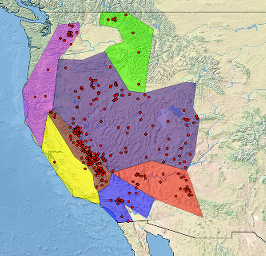
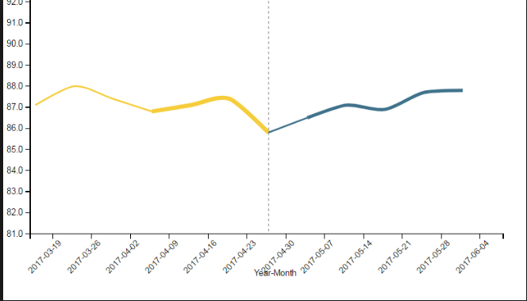
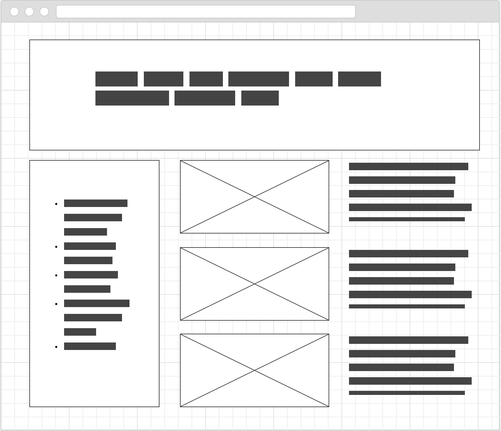
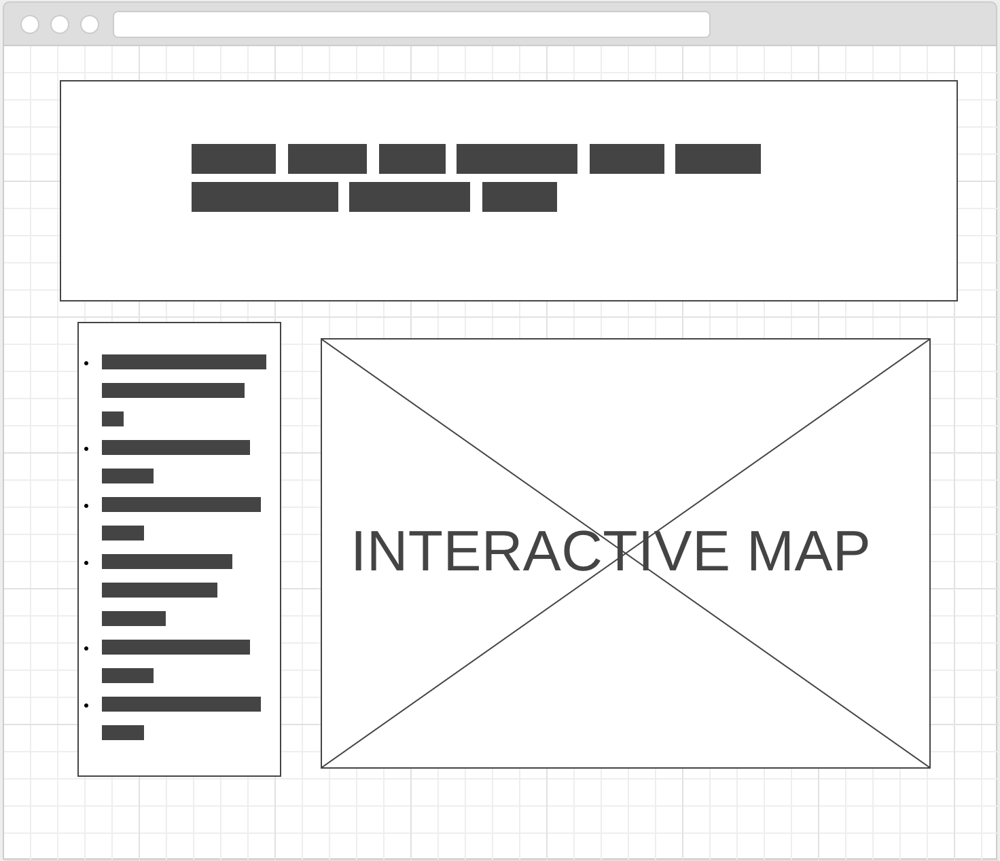
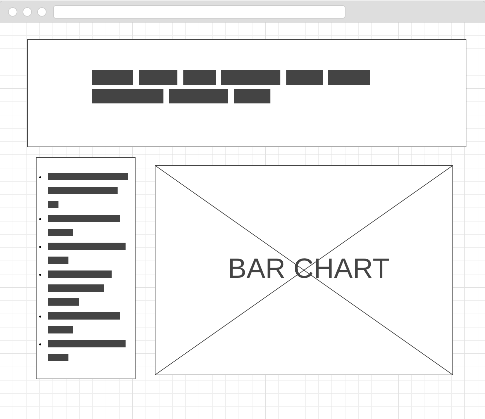

# Project2 - Pyrates! (not really)

## Overview:
To visualize shipwreck data and the effect that lighthouse construction has made on them.

## Objective:
With using a combination of HTML, CSS, leaflet.js, plotly.js, and python (libraries: splinter, beautifulsoup, pandas, flask,and pymysql) we intend to scrape Wikipedia and other sites for lighthouses, and shipwrecks around the US. After obtaining this data, we plan on cleansing, formatting, and storing this data so that it will be utilized in creating maps, and charts.  We plan to create a functional and interactive map using leaflet.js of shipwrecks, and in relation the lighthouses that were constructed.  Our intention is to have a legend that will allow us to display the lighthouses, shipwrecks prior to lighthouse contruction, shipwrecks post lighthouse construction, or any combination or the three.  In addition to this visualtion map we plan to have a line chart displaying the number of shipwrecks over time by region, a bar chart showing the total number of shipwrecks by area/region.

Our goal is to show whether the contruction of lighthouses were influenced by the number of shipwrecks, and whether or not the number of wrecks decreased after construction.

## Data Sources:
1. https://en.wikipedia.org/wiki/Lists_of_shipwrecks
2. https://en.wikipedia.org/wiki/Lists_of_lighthouses
3. https://hub.arcgis.com/datasets/152b9e03b00b46b595df3cbf760ae90f_5/data

## Visualtion Inspiration:
* 
* 

## Mock-up:
### Dashboard Page

### Map Page

### Line Chart Page

### Bar Chart Page

## Repository Location:
* https://github.com/lborgias/Project2

## Languanges
* Python
   Flask
   pymysql
   pandas
   splinter
   beautifulsoup
* HTML/CSS
   Bootstrap
* Javascript
   leaflet.js
     Leaflet.MagnifyingGlass
     Leaflet.BoatMarker
   plotly.js
   turf.js
